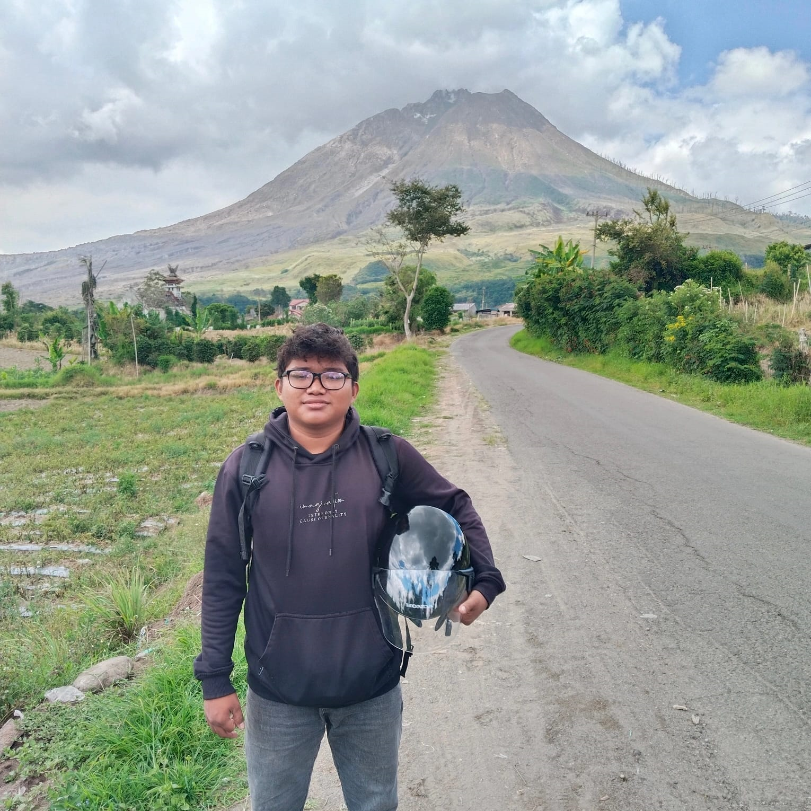

<!DOCTYPE html>
<html lang="id">
<head>
    <meta charset="UTF-8">
    <meta name="viewport" content="width=device-width, initial-scale=1.0">
    <title>Profil 3D Interactive | Alex Alredo Sinaga</title>
    
</head>
<body>

    

        
        
        

            
Alex Alredo Sinaga

        

        
        
NIM: 7243250012

        

            
🚀 Startup

            
💻 Digital

            
📊 Bisnis

        

        

            <strong style="color: #01579b;">Alasan Memilih Bisnis Digital:</strong> 
            "Saya ingin membuka bisnis dan menyediakan lapangan pekerjaan. Di era yang dipenuhi dunia digital ini, jurusan ini adalah fondasi yang paling meyakinkan untuk masa depan."
        

    

    

</body>
</html>
